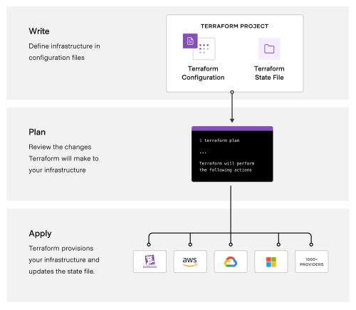

# Introduction 

Thi is the home page containing links to all sub sections of Terraform .

## What is Terraform?

- Terraform is an infrastructure as code tool that lets you build, change, and version cloud and on-prem resources safely and efficiently.

- HashiCorp Terraform is an infrastructure as code tool that lets you define both cloud and on-prem resources in human-readable configuration files that you can version, reuse, and share. You can then use a consistent workflow to provision and manage all of your infrastructure throughout its lifecycle. Terraform can manage low-level components like compute, storage, and networking resources, as well as high-level components like DNS entries and SaaS features.

## How does Terraform work?

- Terraform creates and manages resources on cloud platforms and other services through their application programming interfaces (APIs). Providers enable Terraform to work with virtually any platform or service with an accessible API.

- HashiCorp and the Terraform community have already written thousands of providers to manage many different types of resources and services. You can find all publicly available providers on the Terraform Registry, including Amazon Web Services (AWS), Azure, Google Cloud Platform (GCP), Kubernetes, Helm, GitHub, Splunk, DataDog, and many more.

- The core Terraform workflow consists of three stages:

1. **Write**: You define resources, which may be across multiple cloud providers and services. For example, you might create a configuration to deploy an application on virtual machines in a Virtual Private Cloud (VPC) network with security groups and a load balancer.

2. **Plan**: Terraform creates an execution plan describing the infrastructure it will create, update, or destroy based on the existing infrastructure and your configuration.

3. **Apply**: On approval, Terraform performs the proposed operations in the correct order, respecting any resource dependencies. For example, if you update the properties of a VPC and change the number of virtual machines in that VPC, Terraform will recreate the VPC before scaling the virtual machines.

     

# Details and Links of the Sections 

|S.No                | Topic         | Link |
|----------------    |---------------|-------|
|DAY1| Create Azure Resource Group and Storage Account|[Terraform Script: Create Azure Resource Group and Storage Account](day1/1a_rg_st/README.md) |
|DAY1| Create Azure Resource Group and Storage Account using Variables| [Terraform Script: Create Azure Resource Group and Storage Account using Variables](day1/1b_rg_st_using_vars/README.md) |
|DAY1 | Create Azure Resource Group and Storage Account using locals | [Terraform Script: Create Azure Resource Group and Storage Account using locals](day1/1c_rg_st_using_locals/README.md) |
|DAY1| Create Azure Resource Group and Storage Account using Outputs | [Terraform Script: Create Azure Resource Group and Storage Account using Outputs](day1/1d_rg_st_using_outputs/README.md) |
|DAY2| Exploring local state file by creating Resource group , storage account and servicebus.  | [Terraform Script: Exploring local state file by creating Resource group , storage account and servicebus.](day2/2a-local-state-file/README.md) |
|DAY2|  Creating remote state file using backend.tf by creating Resource group , storage account and servicebus.  | [Terraform Script: Creating remote state file using backend.tf by creating Resource group , storage account and servicebus.](day2/2b-remote-state/README.md) |
|DAY3| Terraform with env management  | [Terraform with env management](day3/3a-env/README.md) |
|DAY3| Terraform using modules | [Terraform with env management](day3/3b-modules/README.md) |
|DAY4| Sample projects| [Links of 4 Sample Projects](day4/README.md) |

