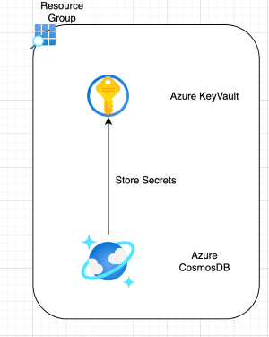
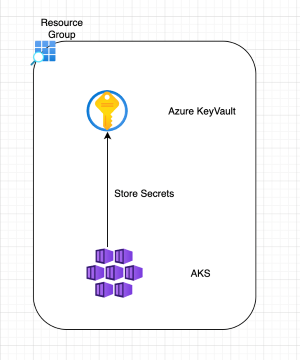

# Links of 4 Sample Projects

- https://github.com/techslateramu/TF-Project-4.2

- https://github.com/techslateramu/TF-Project-5.1

- https://github.com/techslateramu/TF-Project-5.2

### For code repositories of above projects please click on the respective links..

## Here is the common Readme file for all three projects i.e, `TF-Project-4.2` , `TF-Project-5.1` & `TF-Project-5.2`

# `TF-Project-4.2`

## Introduction

This is the terraform script to create Resource Group, Key Vault, KV Access Policy, Key Vault Secrets & Cosmos DB

## Folder Structure

- ### **main**

    `main.tf `-> which has main terraform scripts

    `variables.tf` -> is having all the variables and default values

    `providers.tf` -> is having all the providers required

    `README.md` -> is containing all the help

- ### **modules  -> will have all the sub folders where respetive modules are written**

    `cosmosdb`

    `keyvault`

    `keyvaultsecret`

    `resourcegroup`

## Pre-requisites

- Need to have Azure service principal -> with contributor role is assigned

- Set below envirnment variables `ARM_TENANT_ID` , `ARM_SUBSCRIPTION_ID` , `ARM_CLIENT_ID` , `ARM_CLIENT_SECRET`

## Terraform commands

- Run all the terraform commands from tf_main folder
- No need to import/reference. With in the folder, terraform understands and reads all the .tf files
---------

    terraform init
---------
    terraform validate
---------
    terraform plan
---------
    terraform apply
---------
    terraform destroy

## Description & Notes

- ### Create a resource group module first and call it in main.tf .

- ### Create a key vault module and call it main.tf .

- ### Make sure to create access policy in key vault (because though you create key vault, unless you access it, you will not be able to write secrets to it).

- ### Create a module for cosmosdb and call it main.tf (make sure to write outputs as they may need to push into keyvault).

- ### Create a module for keyvault secret and call it in main.tf (make sure to push the cosmos db outputs as keyvault secrets ).

------------

# `TF-Project-5.1`

## Introduction

This is the terraform script to create Resource Group, Key Vault, KV Access Policy, Key Vault Secrets & AKS Cluster

## Folder Structure

- ### **main** 

    `main.tf `-> which has main terraform scripts

    `variables.tf` -> is having all the variables and default values

    `providers.tf` -> is having all the providers required

    `README.md` -> is containing all the help

- ### **modules**  -> will have all the sub folders where respetive modules are written

    `aks`

    `keyvault`

    `keyvaultsecret`

    `resourcegroup`

## Pre-requisites

- Need to have Azure service principal -> with contributor role is assigned

- Set below envirnment variables `ARM_TENANT_ID` , `ARM_SUBSCRIPTION_ID` , `ARM_CLIENT_ID` , `ARM_CLIENT_SECRET`

## Terraform commands

- Run all the terraform commands from tf_main folder
- No need to import/reference. With in the folder, terraform understands and reads all the .tf files
---------

    terraform init
---------
    terraform validate
---------
    terraform plan
---------
    terraform apply
---------
    terraform destroy

## Description & Notes

- ### Create a resource group module first and call it in main.tf .

- ### Create a key vault module and call it main.tf .

- ### Make sure to create access policy in key vault (because though you create key vault, unless you access it, you will not be able to write secrets to it).

- ### Create a module for aks cluster and call it main.tf (make sure to write outputs as they may need to push into keyvault).

- ### Create a module for keyvault secret and call it in main.tf (make sure to push the aks outputs as keyvault secrets )/

-------------

# `TF-Project-5.2`

## Introduction

This is the terraform script to create

- Resource Group

- Key Vault,

- KV Access Policy,

- Key Vault Secrets

- AKS Cluster

- CosmosDB

- StorageAccount

- FunctionApp

- AppServicePlan

## Folder Structure

- ### **main** 

    `main.tf `-> which has main terraform scripts

    `variables.tf` -> is having all the variables and default values

    `providers.tf` -> is having all the providers required

    `README.md` -> is containing all the help

- ### **modules**  -> will have all the sub folders where respetive modules are written

    `aks`
    `appserviceplan`
    `cosmosdb`
    `functionapp`
    `keyvault`
    `keyvaultsecret`
    `resourcegroup`
    `storageaccount`

## Pre-requisites

- Need to have Azure service principal -> with contributor role is assigned

- Set below envirnment variables `ARM_TENANT_ID` , `ARM_SUBSCRIPTION_ID` , `ARM_CLIENT_ID` , `ARM_CLIENT_SECRET`

## Terraform commands

- Run all the terraform commands from tf_main folder
- No need to import/reference. With in the folder, terraform understands and reads all the .tf files
---------

    terraform init
---------
    terraform validate
---------
    terraform plan
---------
    terraform apply
---------
    terraform destroy

## Description & Notes

- ### Create a resource group module first and call it in main.tf .

- ### Create a key vault module and call it main.tf .

- ### Make sure to create access policy in key vault (because though you create key vault, unless you access it, you will not be able to write secrets to it).

- ### Create a module for storage account, function app, appserviceplan etc

- ### Create a module for cosmosdb,aks cluster and call it main.tf (make sure to write outputs as they may need to push into keyvault)

- ### Create a module for keyvault secret and call it in main.tf (make sure to push the aks outputs, cosmodb outputs as keyvault secrets ).

